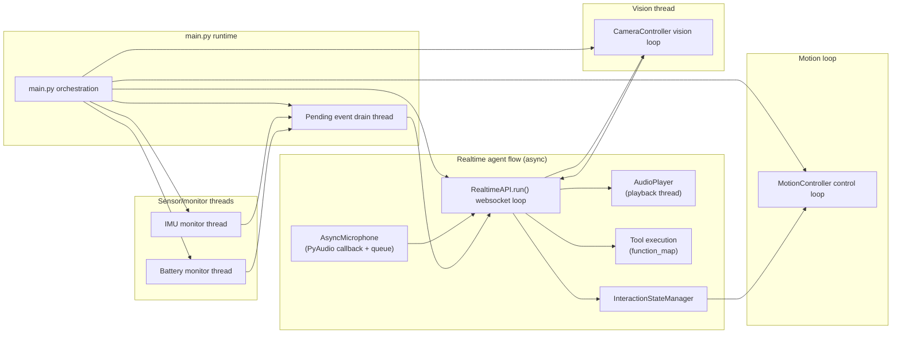

# Agent + Thread Map (pyPiBot)

This document maps the active agents/threads in the current runtime and the data
flows between them. It mirrors the wiring in `main.py` and the thread loops in
the controllers/monitors. The realtime agent thread is the primary agentic
flow, coordinating audio in/out and tool execution.

## Top-Level Runtime Orchestration

The entrypoint in `main.py` builds and launches the following components:

- **Realtime API agent (async loop)**: The primary agent thread that connects to
  OpenAI realtime, manages the websocket event loop, and coordinates tool
  execution, audio input, and audio output. It exposes `is_ready_for_injections`
  for other threads to push events into the conversation context.【F:ai/realtime_api.py†L92-L207】
- **Motion control loop thread**: A background loop that drives the servo
  controller and executes queued gesture/motion actions.【F:motion/motion_controller.py†L90-L176】
- **Vision loop thread**: The camera controller captures frames, detects scene
  changes, and sends images into the realtime agent when ready.【F:hardware/camera_controller.py†L109-L215】
- **IMU monitor thread**: Samples IMU data, derives motion events, and emits
  event callbacks into the main runtime.【F:services/imu_monitor.py†L40-L210】
- **Battery monitor thread**: Samples the ADS1015 voltage, derives battery
  events, and emits callbacks to the runtime.【F:services/battery_monitor.py†L31-L140】
- **Pending event drain thread**: Buffers IMU/battery events until the realtime
  agent is ready, then injects them into the conversation.【F:main.py†L132-L178】

These are all started in `main.py` after the realtime API is initialized and
before the async realtime loop runs.【F:main.py†L110-L246】

## System Map (Visual)

## Flow Details

### 1. Realtime Agent Thread (Audio In/Out + Tools)

**Audio in** is captured by `AsyncMicrophone` via PyAudio’s callback, which
buffers frames into a queue; the realtime loop drains that queue and sends audio
frames to the websocket as `input_audio_buffer.append` events.【F:interaction/async_microphone.py†L15-L140】【F:ai/realtime_api.py†L468-L525】

**Audio out** is driven by websocket events (`response.output_audio.delta`), which
are accumulated and streamed to `AudioPlayer` for playback. When playback
finishes, the microphone is resumed and the agent can accept new audio input.【F:ai/realtime_api.py†L352-L445】

**Tool execution** is driven by realtime function call events
(`response.function_call_arguments.done`), mapped through `function_map`, and
results are returned to the conversation as `function_call_output` items.【F:ai/realtime_api.py†L383-L459】【F:ai/tools.py†L1-L72】

### 2. Vision Thread → Realtime Agent

The camera controller’s vision loop captures low-res luma frames, detects motion
or scene changes, and when a change is detected captures a full-resolution
image. It then queues the image to the realtime agent for injection, using
`send_image_to_assistant()` when the realtime loop is ready; otherwise, it
buffers images until the agent is ready.【F:hardware/camera_controller.py†L146-L266】

### 3. IMU + Battery Monitor Threads → Realtime Agent

The IMU and battery monitors run independent loops and emit events via
callbacks. `main.py` registers handlers that:

1. **Queue events** until the realtime agent declares readiness.
2. **Inject events** as text messages once the websocket is ready, avoiding
   response creation for non-critical events where possible.【F:main.py†L118-L236】

### 4. Motion Loop and Realtime State Hooks

Motion control is a continuous loop running in its own thread. The realtime
agent uses an `InteractionStateManager` to interpret listening/speaking states
and can emit gesture actions (e.g., nods) by pushing actions into the motion
controller queue, assuming the control loop is running.【F:ai/realtime_api.py†L126-L208】【F:motion/motion_controller.py†L90-L272】

## Quick Reference: Threads + Responsibilities

| Thread/Agent | Owner | Purpose | Key Inputs | Key Outputs |
| --- | --- | --- | --- | --- |
| Realtime agent (async loop) | `ai/RealtimeAPI` | Websocket session, audio IO, tool execution | Mic audio, vision/battery/IMU messages | Audio playback, tool calls, state changes |
| Audio input thread | `AsyncMicrophone` | Capture mic audio into buffer | Mic hardware | Audio frames to realtime |
| Audio output thread | `AudioPlayer` | Playback assistant audio | Realtime output audio | Speaker output, playback completion callback |
| Vision thread | `CameraController` | Detect scene changes and push images | Camera frames | Image injections to realtime |
| Motion control loop | `MotionController` | Servo motion execution | Gesture/action queue | Servo position updates |
| IMU monitor | `ImuMonitor` | Sample IMU data, emit events | IMU sensor | Motion events to main/realtime |
| Battery monitor | `BatteryMonitor` | Sample voltage, emit events | ADS1015 sensor | Battery events to main/realtime |
| Pending event drain | `main.py` | Flush queued events when realtime ready | Buffered IMU/battery events | Messages to realtime |
