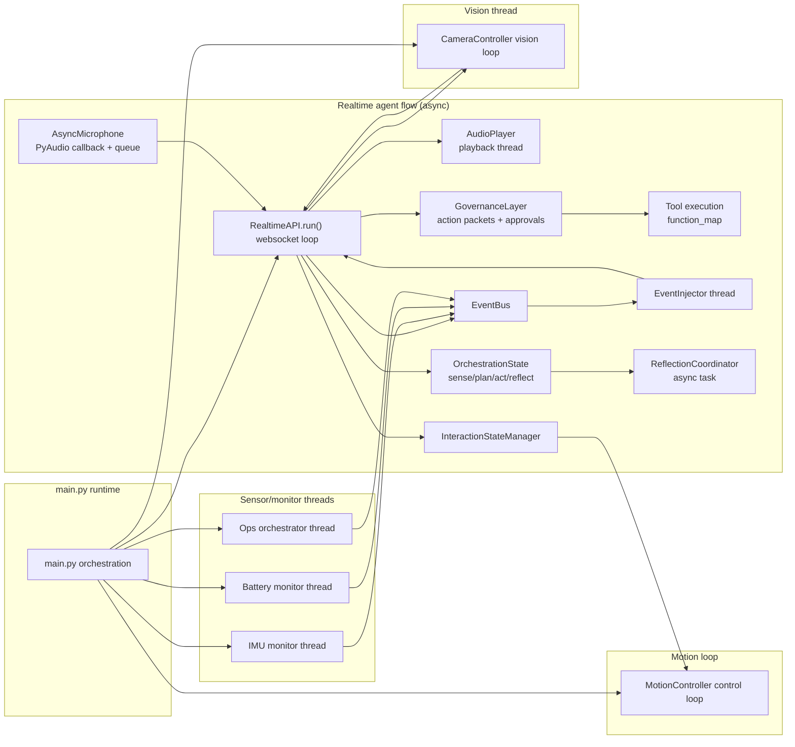

# Agent + Thread Map (pyPiBot)

This document maps the active agents/threads in the current runtime and the data
flows between them. It mirrors the wiring in `main.py` and the thread loops in
the controllers/monitors. The realtime agent thread is the primary agentic
flow, coordinating audio in/out, tool execution, and event injections.

## Top-Level Runtime Orchestration

The entrypoint in `main.py` builds and launches the following components:

- **Realtime API agent (async loop)**: The primary agent thread that connects to
  OpenAI realtime, manages the websocket event loop, and coordinates tool
  execution, audio input, audio output, and event injection. Tool calls are
  routed through the governance layer, which builds structured action packets,
  enforces tiered approvals/autonomy windows, and blocks tool use on stop-word
  emergency phrases. It exposes
  `is_ready_for_injections` for other threads to gate event delivery. It also
  tracks orchestration phases (sense/plan/act/reflect/idle) during the response
  lifecycle and emits phase-transition logs for observability.【F:ai/realtime_api.py†L92-L208】【F:ai/orchestration.py†L1-L27】
- **Governance layer**: Builds action packets for tool calls, applies tool tier
  policy (read-only vs. reversible vs. stateful/credentialed), enforces autonomy
  windows, and decides whether approval is required before execution.【F:ai/governance.py†L13-L320】
- **Event bus (shared queue)**: Thread-safe queue that collects sensor events
  and orders them by priority for injection into the realtime session.【F:ai/event_bus.py†L1-L94】
- **Motion control loop thread**: A background loop that drives the servo
  controller and executes queued gesture/motion actions.【F:motion/motion_controller.py†L90-L176】
- **Vision loop thread**: The camera controller captures frames, detects scene
  changes, and sends images into the realtime agent when ready.【F:hardware/camera_controller.py†L109-L215】
- **IMU monitor thread**: Samples IMU data, derives motion events, and emits
  event callbacks into the main runtime.【F:services/imu_monitor.py†L40-L210】
- **Battery monitor thread**: Samples the ADS1015 voltage, derives battery
  events, and emits callbacks to the runtime.【F:services/battery_monitor.py†L31-L140】
- **Ops orchestrator thread**: Runs a heartbeat loop that executes health
  probes, debounces health states, enforces rolling budgets, and emits health
  snapshots/alerts onto the event bus.【F:services/ops_orchestrator.py†L1-L431】【F:services/health_probes.py†L1-L199】
- **Event injector thread**: Drains the shared event bus, applies cooldown/TTL
  checks, and injects events into the realtime session when the websocket is
  ready.【F:ai/event_injector.py†L1-L79】【F:ai/realtime_api.py†L193-L646】

These are all started in `main.py` after the realtime API is initialized and
before the async realtime loop runs.【F:main.py†L110-L246】

## System Map (Visual)

## Flow Details

### 1. Realtime Agent Thread (Audio In/Out + Tools)

**Audio in** is captured by `AsyncMicrophone` via PyAudio’s callback, which
buffers frames into a queue; the realtime loop drains that queue and sends audio
frames to the websocket as `input_audio_buffer.append` events.【F:interaction/async_microphone.py†L15-L140】【F:ai/realtime_api.py†L468-L525】

**Audio out** is driven by websocket events (`response.output_audio.delta`), which
are accumulated and streamed to `AudioPlayer` for playback. When playback
finishes, the microphone is resumed and the agent can accept new audio input.【F:ai/realtime_api.py†L352-L445】

**Tool execution** is driven by realtime function call events
(`response.function_call_arguments.done`). The realtime agent builds a structured
action packet (what/why/impact/rollback/cost/confidence/alternatives), asks for
approval when required, and enforces autonomy windows before mapping the call
through `function_map` and returning results as `function_call_output` items.
Stop words immediately cancel pending actions and pause tool execution for a
cooldown interval.【F:ai/realtime_api.py†L680-L840】【F:ai/governance.py†L38-L320】【F:ai/tools.py†L1-L72】

### 2. Vision Thread → Realtime Agent

The camera controller’s vision loop captures low-res luma frames, detects motion
or scene changes, and when a change is detected captures a full-resolution
image. It then queues the image to the realtime agent for injection, using
`send_image_to_assistant()` when the realtime loop is ready; otherwise, it
buffers images until the agent is ready.【F:hardware/camera_controller.py†L146-L266】

### 3. IMU + Battery Monitor Threads → Realtime Agent

The IMU and battery monitors run independent loops and publish structured
events to the shared `EventBus`. `main.py` registers handlers that convert
sensor events into bus payloads, and the realtime agent’s `EventInjector`
thread drains the bus when ready, applying cooldown/TTL logic before injecting
messages into the websocket session.【F:services/imu_monitor.py†L109-L153】【F:services/battery_monitor.py†L76-L118】【F:ai/event_injector.py†L1-L79】【F:main.py†L110-L207】

### 4. Ops Orchestrator → Event Bus

The ops orchestrator runs a periodic tick loop to execute health probes,
calculate debounced health status, emit health snapshots, and publish alerts or
budget warnings to the shared event bus. This provides a low-frequency
operations heartbeat alongside the sensor loops and is started/stopped by
`main.py` just like the other background services.【F:services/ops_orchestrator.py†L34-L431】【F:main.py†L174-L233】

### 5. Motion Loop and Realtime State Hooks

Motion control is a continuous loop running in its own thread. The realtime
agent uses an `InteractionStateManager` to interpret listening/speaking states
and can emit gesture actions (e.g., nods) by pushing actions into the motion
controller queue, assuming the control loop is running.【F:ai/realtime_api.py†L126-L208】【F:motion/motion_controller.py†L90-L272】

### 6. Orchestration + Reflection Lifecycle

The realtime loop now tracks orchestration phases with an `OrchestrationState`
helper. Phases transition as the websocket events progress: speech start and
injected text push the state into **sense**, `response.created` moves to
**plan**, function calls enter **act**, and response completion marks
**reflect** before returning to **idle**. Transitions are logged for runtime
diagnostics.【F:ai/realtime_api.py†L493-L793】【F:ai/orchestration.py†L1-L27】

Reflection generation is handled by `ReflectionCoordinator`, which is
configured by `reflection_enabled` and `reflection_min_interval_s` and runs an
async task so the main loop stays responsive. Each reflection captures the last
user input, assistant reply, tool calls, and response metadata, then stores a
JSON payload into `StorageController` (with min-interval and in-flight task
guards). The latest lessons are also pulled from `ReflectionManager` during
session initialization to seed instructions for the next turn.【F:ai/realtime_api.py†L155-L748】【F:ai/reflection.py†L1-L184】【F:services/reflection_manager.py†L1-L88】

## Quick Reference: Threads + Responsibilities

| Thread/Agent | Owner | Purpose | Key Inputs | Key Outputs |
| --- | --- | --- | --- | --- |
| Realtime agent (async loop) | `ai/RealtimeAPI` | Websocket session, audio IO, tool execution | Mic audio, vision/battery/IMU messages | Audio playback, tool calls, state changes |
| Audio input thread | `AsyncMicrophone` | Capture mic audio into buffer | Mic hardware | Audio frames to realtime |
| Audio output thread | `AudioPlayer` | Playback assistant audio | Realtime output audio | Speaker output, playback completion callback |
| Vision thread | `CameraController` | Detect scene changes and push images | Camera frames | Image injections to realtime |
| Motion control loop | `MotionController` | Servo motion execution | Gesture/action queue | Servo position updates |
| IMU monitor | `ImuMonitor` | Sample IMU data, emit events | IMU sensor | Motion events to main/realtime |
| Battery monitor | `BatteryMonitor` | Sample voltage, emit events | ADS1015 sensor | Battery events to main/realtime |
| Ops orchestrator | `OpsOrchestrator` | Health probes, heartbeats, alerts, budgets | Realtime API + system probes | Health snapshots + alert events |
| Event bus | `ai/EventBus` | Thread-safe queue of pending realtime events | Sensor handler events | Prioritized events for injection |
| Event injector thread | `ai/EventInjector` | Flush queued bus events when realtime ready | EventBus entries | Messages to realtime |
