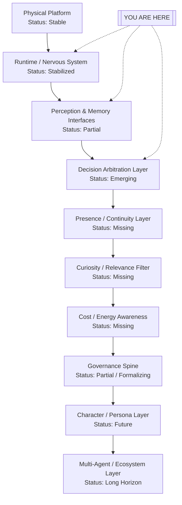

# Theo Cognitive Stack Roadmap

## Purpose

This document captures Theo's current architectural plateau, the next major
layers to build, and long-horizon direction. It is intended to guide both human
maintainers and coding agents so work lands in the right conceptual layer.

## You Are Here

Theo has moved from repeated runtime break/fix work to a more stable realtime
foundation.

- **Physical Platform**: real and operational.
- **Runtime / Nervous System**: meaningfully stabilized (response lifecycle,
  transcript-final upgrade paths, tool follow-up release points, health snapshot
  semantics, shutdown behavior, and single-flight arbitration).
- **Perception & Memory Interfaces**: partially working, still rough and in need
  of stricter signal discipline.
- **Decision Arbitration and above**: mostly frontier and emerging
  architecture.

> **You are here:** stable runtime base with partial perception/memory,
> entering explicit behavior-architecture buildout and preparing to formalize
> decision arbitration.

## Cognitive Stack (Layer View)

## Layer-by-Layer Guidance

### 1) Physical Platform
- **What it is:** hardware substrate (Pi, sensors, actuation, audio stack).
- **Unlocks:** embodied operation and observability.
- **Why it matters:** all higher capabilities depend on reliable I/O and power.
- **Status:** **stable**.

### 2) Runtime / Nervous System
- **What it is:** lifecycle transport and control plumbing (realtime loop,
  cancel/replace semantics, scheduling/release boundaries, shutdown behavior,
  single-flight/idempotency guards).
- **Unlocks:** deterministic, debuggable execution.
- **Why it matters:** this is the safety rail for all upper-layer cognition.
- **Status:** **meaningfully stabilized**; preserve this plateau.

### 3) Perception & Memory Interfaces
- **What it is:** context intake, memory retrieval and preference recall,
  grounding quality controls.
- **Unlocks:** continuity and context-aware behavior.
- **Why it matters:** better signal quality is a prerequisite for good
  arbitration.
- **Status:** **partial**.

### 4) Decision Arbitration Layer
- **What it is:** explicit policy for selecting what to do now vs later vs never,
  including conflict resolution among candidate actions.
- **Unlocks:** coherent behavior instead of opportunistic or locally emergent responses.
- **Why it matters:** this is the next critical architecture frontier.
- **Status:** **emerging / next primary build target**.

### 5) Presence / Continuity Layer
- **What it is:** durable short/medium-horizon continuity of goals,
  commitments, unresolved threads, and situational stance across turns/runs.
- **Unlocks:** consistent conversational and operational presence.
- **Why it matters:** avoids "reset every turn" behavior.
- **Status:** **missing (mid-horizon)**.

### 6) Curiosity / Relevance Filter
- **What it is:** attention strategy that prefers high-value signals and suppresses
  noise.
- **Unlocks:** better focus and less context bleed.
- **Why it matters:** improves grounding and reduces wasted work.
- **Status:** **missing (mid-horizon)**.

### 7) Cost / Energy Awareness
- **What it is:** explicit budget and energy tradeoff logic (latency, API spend,
  battery, tool cost).
- **Unlocks:** durable autonomy under constraints.
- **Why it matters:** prevents expensive/fragile behavior loops.
- **Status:** **missing (mid-horizon)**.

### 8) Governance Spine
- **What it is:** policy boundaries for permissions, risk tiers, confirmation
  behavior, and fail-closed controls.
- **Unlocks:** safe execution and accountable escalation behavior.
- **Why it matters:** keeps autonomy bounded and auditable.
- **Status:** **partial; formal boundary work needed**.

### 9) Character / Persona Layer
- **What it is:** explicit voice/behavior shaping with drift controls.
- **Unlocks:** coherent long-term identity expression.
- **Why it matters:** persona should be managed intentionally, not as prompt
  side effects.
- **Status:** **future**.

### 10) Multi-Agent / Ecosystem Layer
- **What it is:** Theo-to-Theo or Theo-to-service coordination and shared intent.
- **Unlocks:** collaborative distributed behavior.
- **Why it matters:** expands capabilities beyond a single runtime instance.
- **Status:** **long horizon**.

## Roadmap by Horizon

### Near Horizon (protect base + prepare arbitration)
- Preserve runtime stability and deterministic lifecycle semantics.
- Strengthen perception/memory discipline and retrieval relevance.
- Investigate and formalize decision arbitration surfaces.
- Reduce weak grounding and opportunistic context bleed.
- Improve noisy low-value signal handling.
- Document and normalize current arbitration behavior before large refactors.

### Mid Horizon (build missing cognitive layers)
- Build an explicit decision arbitration layer.
- Add a presence/continuity layer.
- Add curiosity/relevance filtering.
- Add cost/energy awareness.
- Clarify governance boundaries versus runtime safeguards.

### Long Horizon (ecosystem evolution)
- Add character/persona drift controls.
- Enable richer autonomous behavior under explicit policy boundaries.
- Improve local/cloud balancing.
- Support robot-to-robot and ecosystem coordination.

## Development Directive (Architectural Law)

1. Preserve runtime stability.
2. Build upward from stable layers.
3. Do not bury cognitive policy inside transport/lifecycle plumbing.
4. Distinguish runtime safeguards from arbitration from governance.
5. Prefer explicit layer ownership over scattered feature flags.

## How Agents Should Use This Roadmap

When working in Theo:

1. **Classify the request by layer first** (runtime, perception/memory,
   arbitration, governance, persona, ecosystem).
2. **Place logic in the owning layer**, not in lower-level plumbing for
   convenience.
3. **Only touch runtime plumbing** (e.g., `ai/realtime_api.py` lifecycle paths)
   when the issue is genuinely lifecycle/transport determinism.
4. **Separate bug-fix work from new-layer development** in proposals and commits.
5. **Preserve deterministic runtime behavior** while evolving higher-order
   cognition.
6. **Do not confuse** single-flight/idempotency, scheduling/queueing, arbitration, and governance; these are related but not interchangeable.
